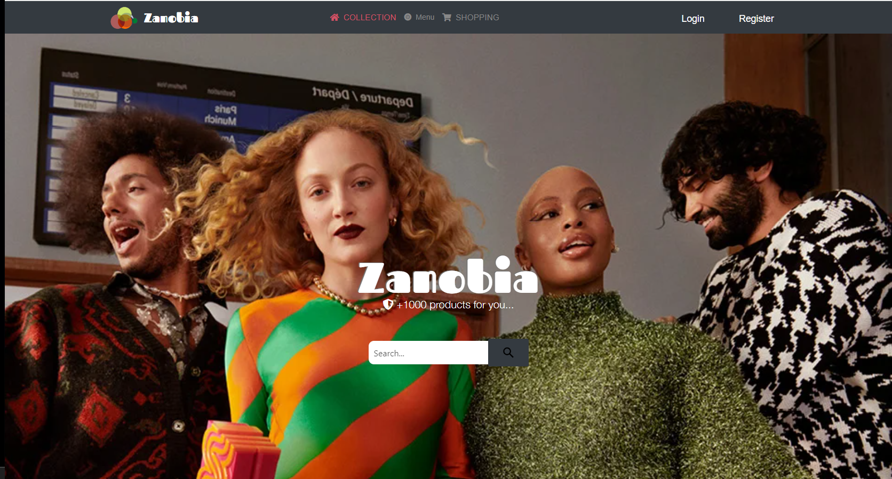
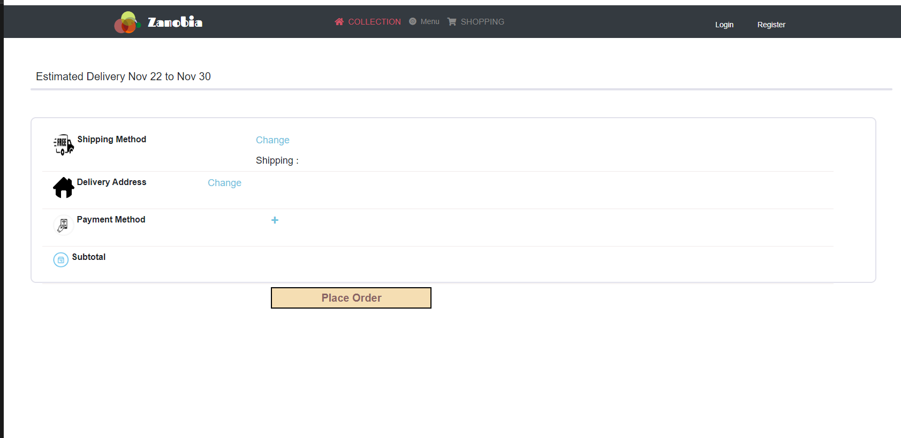

# Online Store: [Zanobia]( https://mays-m.github.io/OnlineStore/)

 The idea of the website to have a dynamic online store that help the customers to find their needs in different path of life .
 the website was inspire by zara.fi. The ideaa of choosing this name because I found this name can be avilable in the market and easy to remember. Zanobia a name you be intersting about it and isn't easy to forget.

## Resourcing

The resoures used in this assignment is many websites to get ideas for the project and for the technologies used also 

- w3school.com
- github.com 
- Wimma lab:  project I was working with in WiMMA LAB called conduit I used some function to use java script in the project .
- zara.fi : To have an idea of the front-end should be like even the website 'Zanobia' ended totally differenet 

### use of time to the project was about 80-100h 
 - The time consumed quite alote beacuse I worked with two different websites and I wasn't sure about the best idea to go with but I choice the online store 

## Technology choices with reasoning behind them
- HTML : For front-end development of the website to create a content and add pictures to the page.
-  advanced CSS3 : Responsive design is the term commonly used for describing that approach.For Web developers, it is now fairly common to be called upon to create a Web site or app that changes its user interface depending on the browser or device accessing the site to provide an optimized experience. One approach to this is to create different versions of your site/app for different platforms or browsers and serve them appropriately after detecting which browser or platform is looking at your site. But this is increasingly inefficient: browser sniffing is inherently error prone, and maintaining multiple copies of your code can turn out to be a nightmare.
- Advanced JavaScript : used some js to wotrk with some function so the customer can use the online store to buy items and add item to the cart.

## General thoughts about the work process and what was learned :

### Features of the website  
- User can buy any type of products. 
- Users can sort & filter different kinds of products according to price, delivery time and importing country.
- Users can login or create an account.
- User can save their favoirte products

### Page and Responsibilities

* Home Page
* Product Page :
** filter/Sort: User can filter/Sort the products according to choice.
** Product Description Page: User can get more information about product
* Cart Page: user can add and remove products from cart
* Wish List Page: users can save their favorite products.
* Payment Page: user will have to fill their payment details.

### 📌 How to use
Users can log in into the website by clicking the login button and fill in the right credentials, 
new users can register themself by clicking on the register button and fill a simple form, after successful 
login user can start shopping, they can choose the category that they like also they can sort the product 
according to their choice, after choosing a product they can add it to the cart or keep it on the wishlist.
They can place an order by simply clicking on the place order.

## Creators  

#### Mays-M

 

